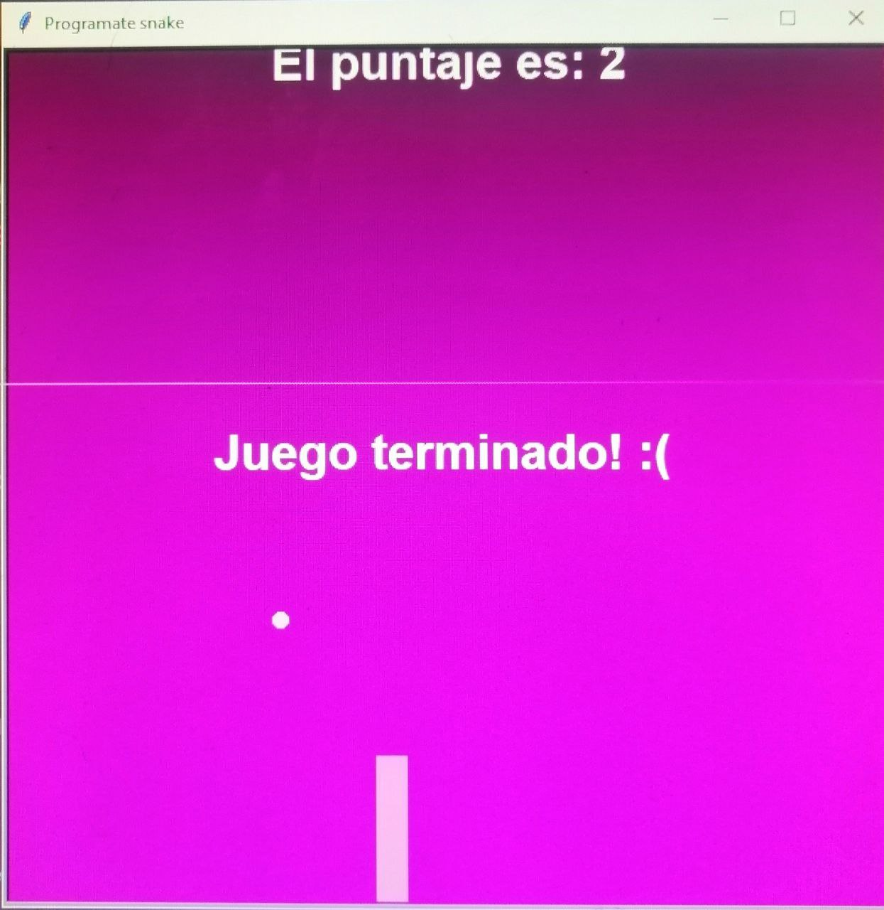

<h1>Snake</h1>

<em> Educamás -> <a href="https://educamas.com.co/">Programate</a> Cohorte IV REEDOM DEVELOPER. 💻  
</em>

Creamos el juego del gusanito con python

⚙️ Technologies

☕️  python
 

<h3>Librerias</h3> 
Importamos turtle, time
 

Para crear el juego trabajamos con POO creando las diferentes clases a usar con sus metodos y atributos.

⚙️ Deploy available: https://daniela8896.github.io/snake/

